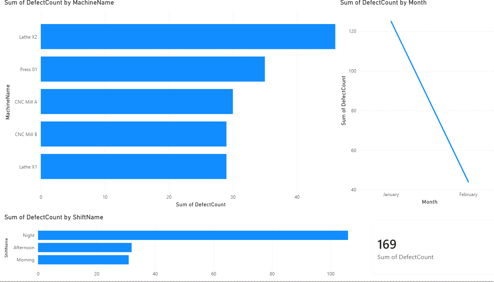

# manufecturing-defect-tracker

A data analytics project simulating a real-world manufacturing quality control system.
Built using SQL Server and Power BI.

## Tools Used
- SQL Server Express
- SQL Server Management Studio (SSMS)
- Power BI Desktop

## Project Overview
Designed and queried a relational database tracking production runs and defects
across 5 machines and 3 shifts. Built an interactive Power BI dashboard to
visualize quality control insights.

## Database Schema
- **Machines** — machine names and factory floor locations
- **Shifts** — morning, afternoon, and night shift schedules
- **ProductionRuns** — daily production output per machine per shift
- **Defects** — defect type and count per production run

## SQL Queries
- Defect rate by machine (JOIN across 3 tables)
- Defect rate by shift
- Monthly defect trend over time

## Key Insights
- Lathe X2 had the highest total defect count
- Night shift produced significantly more defects than morning or afternoon
- Defects decreased from January to February 2024

## Dashboard Visuals
- Bar chart: Total defects by machine
- Bar chart: Total defects by shift
- Line chart: Defect trend by month
- KPI card: Total defects

## Dashboard Preview

